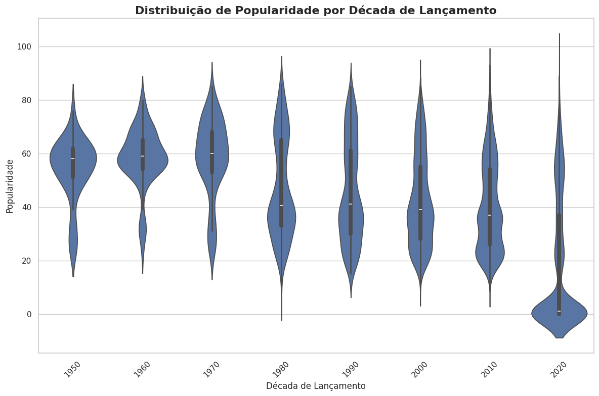

# README

## English

### Project Overview
This project involves data analysis of the rock genre using Spotify data, employing linear regression to identify trends and insights. The analysis is based on data extracted from Spotify, focusing on various audio features and popularity metrics.

### Data Sources
- **Spotify API**: Used to fetch track data including features like danceability, energy, valence, etc.
- **Dataset**: The dataset includes tracks from various decades, categorized by genre and other attributes.

### Key Features Analyzed
- **Acousticness**: Describes how acoustic a track is. A score of 1.0 indicates a high likelihood of being acoustic.
- **Liveness**: Indicates the probability that the track was recorded with a live audience. A value above 0.8 suggests a strong likelihood of live performance.
- **Speechiness**: Detects the presence of spoken words in a track. Scores above 0.66 indicate tracks that are likely spoken word.
- **Energy**: Measures the intensity and activity of a track. Energetic tracks are usually fast, loud, and noisy.
- **Danceability**: Describes how suitable a track is for dancing based on tempo, rhythm stability, beat strength, and overall regularity.
- **Valence**: Measures the musical positiveness conveyed by a track. Higher valence sounds more positive.

### Analysis and Findings
- **Popularity Trends**: Analyzed the popularity of rock tracks over different decades.
- **Linear Regression**: Used to identify trends in track popularity over time.
- **Genre Comparison**: Compared the popularity of rock with other genres.

### Results
- The analysis revealed a trend where older rock tracks tend to have higher popularity.
- The linear regression model indicated a negative coefficient, suggesting a decrease in popularity over the years.

### Tools and Libraries
- **Pandas**: For data manipulation and analysis.
- **Matplotlib & Seaborn**: For data visualization.
- **Scikit-learn**: For implementing linear regression.

### How to Run
1. Ensure you have Python installed.
2. Run the Jupyter notebook to see the analysis and visualizations.

---

## Português

### Visão Geral do Projeto
Este projeto envolve a análise de dados do gênero rock usando dados do Spotify, empregando regressão linear para identificar tendências e insights. A análise é baseada em dados extraídos do Spotify, focando em várias características de áudio e métricas de popularidade.

### Fontes de Dados
- **API do Spotify**: Usada para buscar dados de faixas, incluindo características como danceability, energy, valence, etc.
- **Conjunto de Dados**: O conjunto de dados inclui faixas de várias décadas, categorizadas por gênero e outros atributos.

### Principais Características Analisadas
- **Acousticness**: Descreve o quão acústica é uma faixa. Um score de 1.0 indica uma alta probabilidade de ser acústica.
- **Liveness**: Indica a probabilidade de que a faixa foi gravada com uma audiência ao vivo. Um valor acima de 0.8 sugere uma forte probabilidade de performance ao vivo.
- **Speechiness**: Detecta a presença de palavras faladas em uma faixa. Scores acima de 0.66 indicam faixas que provavelmente são faladas.
- **Energy**: Mede a intensidade e atividade de uma faixa. Faixas energéticas são geralmente rápidas, altas e barulhentas.
- **Danceability**: Descreve quão adequada é uma faixa para dançar com base no tempo, estabilidade do ritmo, força do batimento e regularidade geral.
- **Valence**: Mede a positividade musical transmitida por uma faixa. Valências mais altas soam mais positivas.

### Análise e Resultados
- **Tendências de Popularidade**: Analisou a popularidade das faixas de rock ao longo de diferentes décadas.
- **Regressão Linear**: Usada para identificar tendências na popularidade das faixas ao longo do tempo.
- **Comparação de Gêneros**: Comparou a popularidade do rock com outros gêneros.

### Resultados
- A análise revelou uma tendência onde faixas de rock mais antigas tendem a ter maior popularidade.
- O modelo de regressão linear indicou um coeficiente negativo, sugerindo uma diminuição na popularidade ao longo dos anos.

### Ferramentas e Bibliotecas
- **Pandas**: Para manipulação e análise de dados.
- **Matplotlib & Seaborn**: Para visualização de dados.
- **Scikit-learn**: Para implementar regressão linear.

### Como Executar
1. Certifique-se de ter o Python instalado.
2. Execute o Jupyter notebook para ver a análise e visualizações.